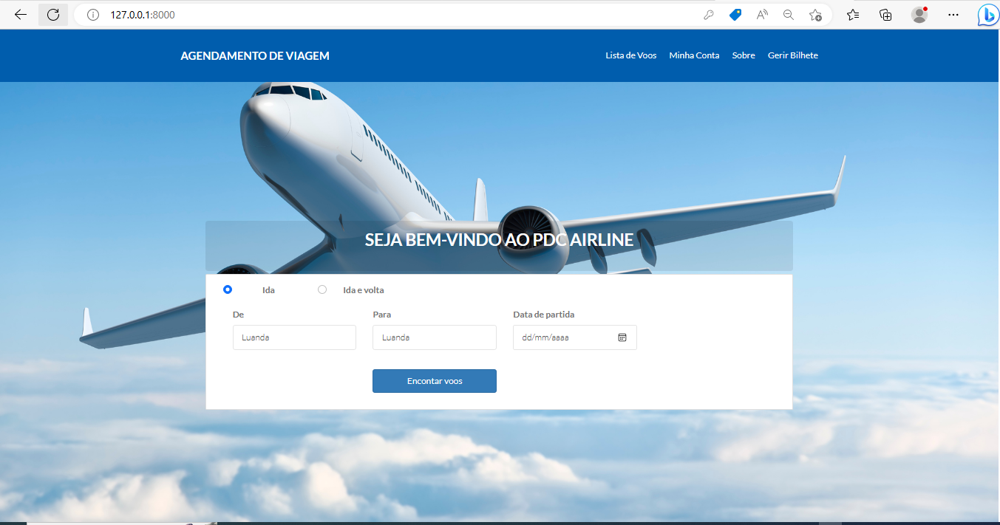

# PDC AIRLINE

PDC AIRLINE consiste na venda de bilhetes de um determinado Voo.

## Layout do Projecto




# Framework
Laravel

# Como executar o projeto

```bash
# clonar repositório
https://github.com/Felismino2022/pdc_airline.git

# executar o projeto
php artisan serven
```


# Autor

Felismino Muchombo
